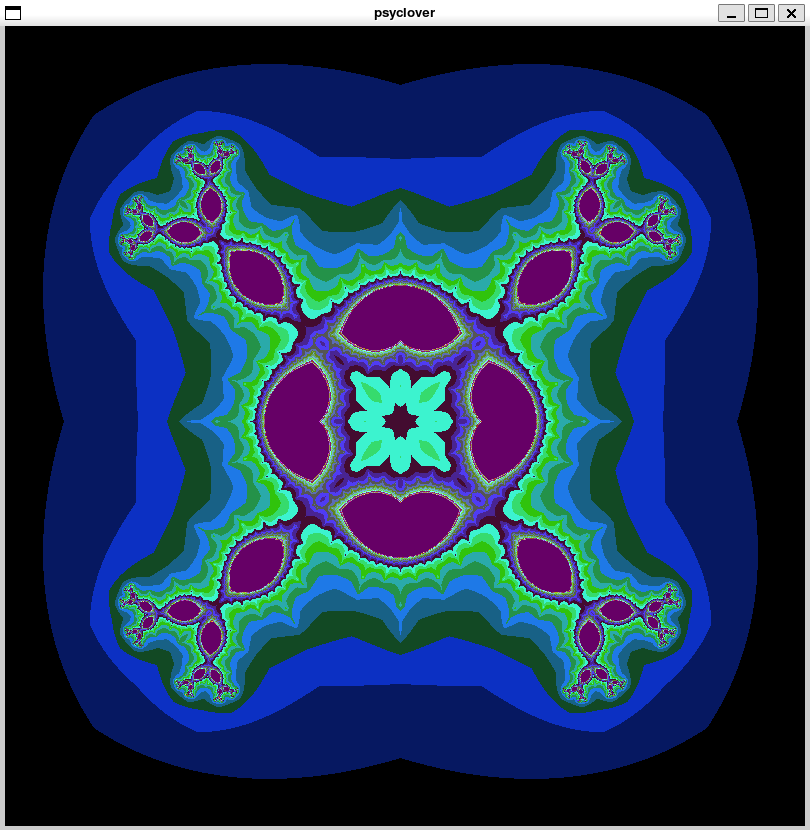

<h1 align="center">Fractol</h1>

<p align="center">
	
</p>

## About It

-   It's a simple graphical program that renders a [fractal](https://pt.wikipedia.org/wiki/Fractal), which can be interact with, zooming in and out, and moving with WASD keys. Esc closes it, as well.
-   This Fractol Project was created to be delivered as one of the projects requested by 42 Rio Common Core.
-   It was done using [42's MiniLibX](https://github.com/42Paris/minilibx-linux) Graphical Library for C.
-   Also, there where some limitations, regarding libraries permitted for it, and according to [42's norme](https://github.com/MagicHatJo/-42-Norm/blob/master/norme.en.pdf), imposed in the project.

## Usage

-   You should have 42's MiniLibX installed in your machine, to compile the project as it is. As the use of mlx is not the focus now, I left it installed and precompiled with the project, so there should be no issues. It sure means that this, as it is, will not pass any 42 evaluation, so be aware.
-   To compile it, simply run the common make command, or make bonus, for the improved bonus version.

```Bash
make
```

or

```Bash
make bonus
```

-   Then, it should be compiled, and to run it, it's as simple, as run it with one of the Fractals permitted.

```Bash
./fractol <fractal name>
```

-   In case of wrong usage, it will warn you, showing the allowed fractals.
